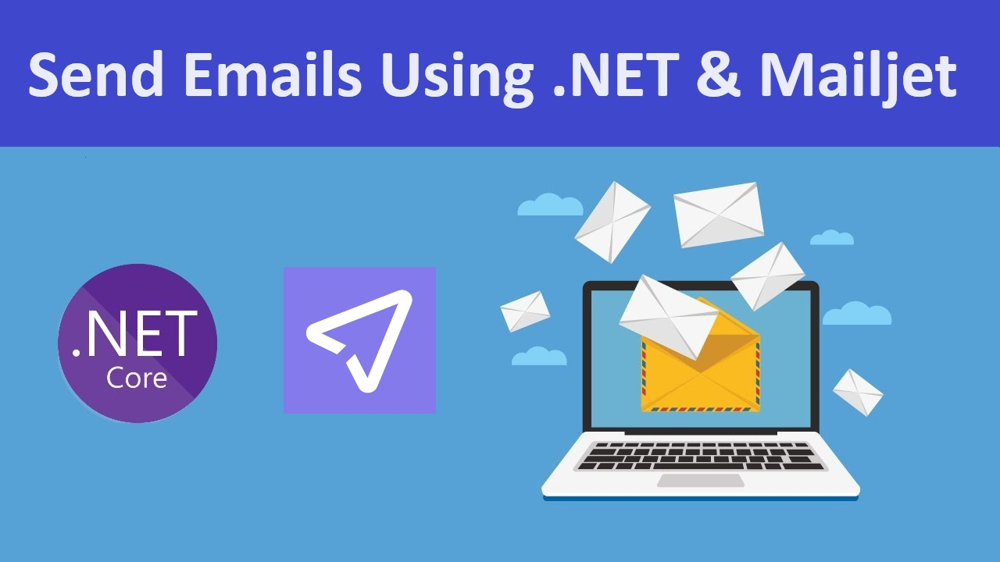

# Sending Email using ASP.NET Core & Mailjet

A simple example of a sending email project using ASP.NET Core and Mailjet

<div align="center">
  <kbd>
    
  </kbd>
</div>

## Description

This is a ASP.NET Core 8 MVC project that demontrates how to send an email using Mailjet. You would need a mailjet account with api keys to test.


### Built with

- ASP.NET Core

## Getting started


### Install

All you have to do is download or clone the project. Open in visual studio, then provide your Mailjet details in the `appsettings.json` file.
```
  "SystemConfiguration": {
    "MailjetEmail": "your-mailjet-email@example.com",
    "MailjetApiKey": "your-mailjet-public-key",
    "MailjetSecretKey": "your-mailjet-private-key"
  }
```
That's all. Now run the project and test the email.

This project uses a html email template provided by [htmlemail.io](https://github.com/leemunroe/responsive-html-email-template)

The email template is located in `Files\email.html`

### License

This project is licensed under the [MIT License](https://opensource.org/licenses/MIT).